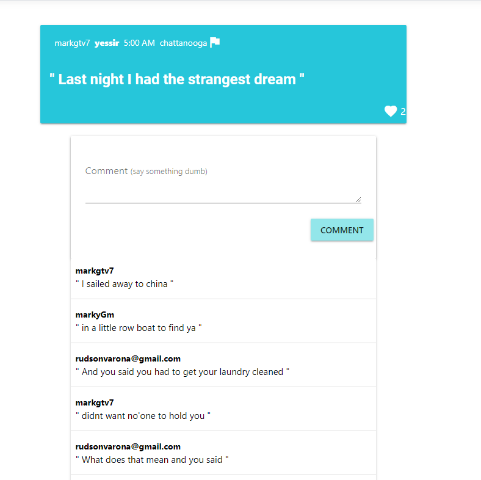
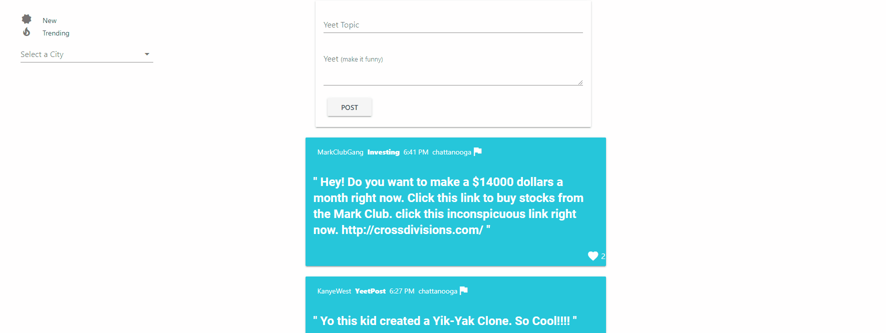

# YeetPost

YeetPost is a location based forum web application like Yik Yak. 

<h2>Key features:</h2>
<ul>
    <li>Add Yeets in specific loations.</li>
    <li>Add users</li>
    <li>Like Yeets, Filter Yeets, Create Yeets, Comment on Yeets, Delete Yeets</li>
    <li>Working on* updating locations.</li>
    <li>Support for Banned Users</li>
</ul>

<h2>Technologies</h2>

.NET Core,C# , Vue.js, MVC, Google Firebase SDKs.

<h2>Screenshots</h2>

  
  

  